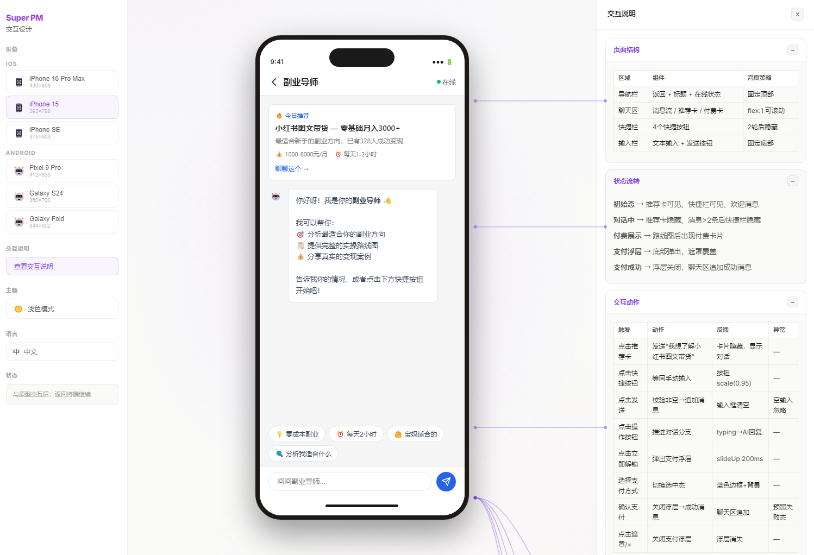

# Super PM - AI Interaction Design Skill

> Let product managers have design superpowers. One person delivers the output of a professional design team.



## What is this?

Super PM is an AI Skill for **Claude Code / Trae / Codex** that turns your AI assistant into a senior interaction designer. Describe what you want to build, and it walks you through a structured workflow to produce **browser-previewed, high-fidelity prototypes** with complete interaction specifications.

## Features

- **Structured Workflow** - P0 Memory Scan > P1 User Profiling > P2 Design System > P3 Task Flow > P4 Multi-scheme Comparison > P5 Prototype & Spec > P6 Handoff/Dev
- **Visual Companion** - Real-time browser preview with device frames (iPhone, Pixel, Galaxy), interaction specs sidebar, and connector lines
- **Light / Dark Themes** - Pearl (light) and Obsidian (dark) themes with smooth transitions
- **EN / CN Languages** - Switch between English and Chinese with one click
- **Multi-device Preview** - iPhone 16 Pro Max, iPhone 15, iPhone SE, Pixel 9 Pro, Galaxy S24, Galaxy Fold
- **Hot-reload Templates** - Modify the Visual Companion without restarting the server or regenerating prototypes
- **Design System First** - Enforces user profiling and design system alignment before any prototype work

## Quick Start

1. Copy this folder to your AI Skill path:
   ```
   ~/.claude/skills/super-pm/
   ```

2. Tell your AI assistant:
   ```
   I want to design a new feature for my app
   ```

3. The AI will guide you through the workflow, starting with user profiling.

## Project Structure

```
super-pm/
  SKILL.md              # Core skill definition (AI instructions)
  README.md             # This file
  docs/                 # Screenshots and documentation assets
  references/           # Design patterns, templates, guides
  scripts/
    server.cjs          # Visual Companion server (WebSocket + HTTP)
    frame-template.html # UI shell with themes, i18n, device frames
    helper.js           # Client-side interaction capture
    start-server.sh     # Server launcher
    stop-server.sh      # Server stopper
```

## Visual Companion

The Visual Companion is a local web server that renders design options, prototypes, and interaction specs in your browser. It supports:

| Feature | Description |
|---------|-------------|
| Device Frames | 6 device models with accurate bezels and status bars |
| Interaction Spec | Collapsible spec cards with connector lines to prototype |
| Theme Toggle | Pearl (light) / Obsidian (dark), saved to localStorage |
| Language Toggle | English / Chinese, saved to localStorage |
| Multi-scheme Canvas | Side-by-side comparison of 2-3 design schemes |
| Hot Reload | Template changes apply on browser refresh, no server restart |

## Requirements

- Node.js 16+
- A compatible AI assistant (Claude Code, Trae, or similar)
- A modern browser

## License

MIT

---

*Built with Claude Code*
