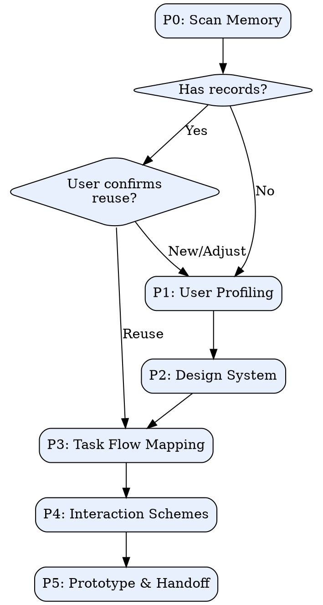

# Interaction Design

## Overview

核心哲学：**先懂人、再定调、后画图** — 任何交互产出必须建立在用户画像和设计系统之上，杜绝凭感觉出方案。

## Interaction Rules

**每次只问一个问题。** 不要在同一条消息中抛出多个问题，用户只需回复一个答案。

**选择题优先。** 尽量用选项表格（3-5 项）代替开放式提问，降低用户认知负荷。

**必须标注推荐。** 每个选择题必须标注推荐选项并给出推荐理由，不推荐的选项简要说明原因（如权衡、复杂度、风险等）。用户只需回复序号/字母。

**格式示例：**

| 选项 | 描述 | 推荐度 |
|------|------|--------|
| **A** | 方案描述 | ★★★★★ 推荐 — 理由说明 |
| **B** | 方案描述 | ★★★ — 权衡说明 |
| **C** | 方案描述 | ★★ — 不推荐原因 |

<HARD-GATE>

**禁止在缺少用户画像或设计系统时生成交互方案/原型。**

合法来源（二选一）：
1. 当前会话中通过 P1 + P2 新建
2. 从 `.super-pm/memory/` 复用已有记录，且用户已确认

未满足条件时，停止并引导用户先完成 P1/P2。

</HARD-GATE>

## Mode Detection

| 维度 | 新建模式 | 优化模式 |
|------|----------|----------|
| 触发信号 | "从零设计"、"新功能"、无历史记录 | "优化"、"改版"、"转化率低"、已有线上页面 |
| P0 行为 | 扫描记忆，多数情况走新建 | 扫描记忆，优先复用已有画像/系统 |
| P1-P2 | 必须完整执行 | 可基于已有记录微调 |
| P3 差异 | 全量任务流梳理 | 聚焦问题环节 |
| P4 差异 | 至少2套完整方案 | 针对性改进方案 + 对照组 |

## Process

## Checklist

- [ ] **P0 Memory Scan** — 扫描 `.super-pm/memory/`，检查可复用的画像和设计语言
- [ ] **P1 User Profiling** — 用户画像 + 核心场景 → 详见 [design-system-guide.md](references/design-system-guide.md) §用户画像
- [ ] **P2 Design System** — **必须先启动 Visual Companion 服务器**，8维度逐个在浏览器中渲染选项，禁止纯文字呈现 → 详见 [design-system-guide.md](references/design-system-guide.md)
- [ ] **P3 Task Flow** — 任务流 + 情感地图 → 参考 [interaction-patterns.md](references/interaction-patterns.md)
- [ ] **P4 Schemes** — 多套交互方案（≥2套） → 详见 [interaction-patterns.md](references/interaction-patterns.md)
- [ ] **P5 Prototype** — 中保真原型 + 验证 → 详见 [prototype-templates.md](references/prototype-templates.md)

## P0 Memory

扫描 `.super-pm/memory/` 下两个子目录：

- `user-profiles/` — 已有用户画像
- `design-systems/` — 已有设计系统

**流程**：列出摘要 -> 询问用户"复用 / 微调 / 全新创建" -> P1/P2 完成后自动保存到记忆目录。

## P4 Scheme Dimensions

方案对比维度从以下池中智能选取，需说明选取理由：

| 维度类型 | 适用场景 |
|----------|----------|
| 复杂度梯度 | 功能范围不确定，需MVP与完整版对比 |
| 用户群体 | 多角色/多场景，不同群体需求分化 |
| 设计哲学 | 极简 vs 功能丰富、引导式 vs 自由探索 |
| 组合混搭 | 以上维度交叉组合 |

**硬约束**：最少2套方案，支持维度混搭。

## Visual Companion（必须执行）

<HARD-GATE>
P2-P5 的可视化内容必须通过浏览器呈现。禁止用终端文字/表格替代。
</HARD-GATE>

**进入 P2 前必须执行以下启动步骤：**

1. 用 Bash 工具运行：`~/.claude/skills/super-pm/scripts/start-server.sh --project-dir {当前项目路径}`
2. 服务器返回 JSON，从中提取 `url`、`screen_dir`、`state_dir`，保存为变量
3. 告诉用户打开浏览器访问返回的 URL
4. 等用户确认已打开浏览器后，才开始 P2

**P2-P5 每次可视化输出时：**

1. 用 Write 工具将 HTML 片段写入 `screen_dir`（如 `dim1-colors.html`），不要用 Bash/cat/heredoc
2. HTML 只写内容片段（不要 `<!DOCTYPE>`），服务器自动包裹框架和交互脚本
3. 用 `.options > .option[data-choice]` 结构让用户点选，参考 [design-system-guide.md](references/design-system-guide.md) 中的 HTML 示例
4. 在终端只发一句话提示用户去浏览器查看，不要在终端重复渲染内容
5. 读取 `state_dir/events` 获取用户的点击选择

详细渲染规范和 HTML 示例见 [design-system-guide.md](references/design-system-guide.md) 和 [prototype-templates.md](references/prototype-templates.md)。

## Red Flags

| 借口 | 真相 |
|------|------|
| "不需要用户画像，需求很清楚" | 自以为清楚 ≠ 用户视角清楚 |
| "太简单不需要设计系统" | 没有系统就没有一致性 |
| "先出原型再说" | 没有画像的原型是盲人摸象 |
| "跳过任务流直接画页面" | 页面是任务流的投影，源头不能跳 |
| "改动很小不走流程" | 小改动也需上下文，否则埋隐患 |
| "直接复用上次的画像" | 必须经用户确认，场景可能已变 |
| "一套方案就够了" | 没有对比就没有决策依据 |
| "用文字表格展示设计选项也行" | 设计是视觉的，文字描述颜色≠看到颜色。必须启动浏览器渲染 |
